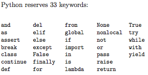

# Values and Types
1.  Value
    - basics things a program works with
    - letter or number

2.  Types
    - Integer, String

    ``` python
    type(2)

    or

    type("Hello, World!")

    ```

    - 2: Integer
    - "Hello, World!": String

# Variables
- names that refer to a value

``` python
message = 'And now for something completely different'
n = 17
pi = 3.1415926535897931

print(message)
print(n)
print(pi)

type(message)
type(n)
type(pi)
```

# Variable names and keywords
- are case sensitive
- meaningful
- can be arbitrarily long
- can contain both letters and numbers
- cannot start with a number
- legal to use uppercase letters, but it is a good idea to begin variable names with a lowercase letter
- underscore character \(\_\) can appear in a name; often used in names with multiple words, such as my_name or airspeed_of_unladen_swallow
- Variable names can start with an underscore character; but generally avoid doing this unless used for writing library code for others to use.
- Python reserves 33 keywords:




# Statements
- unit of code that the Python interpreter can execute
- **print** and **assignment**

# Operators and operands
- \+, \-, \*, \/, and \*\*; addition, subtraction, multiplication, division, and exponentiation

# Expressions
- combination of values, variables, and operators

# Order of operations
- rules of precedence; PEMDAS
- Parentheses, Exponentiation, Multiplication, Division, Addition, Subtraction

# Modulus operator
- \%; remainder

# String operations
- \+ operator works with strings; concatenation

# Asking the user for input
- **input**; gets input from the keyboard

# Comments
- **#**; notes to your programs to explain in natural language what the program is doing

# Choosing mnemonic variable names
``` python
for word in words:
  print(word)
```

is

``` python
for slice in pizza:
  print(slice)
```

# Debugging
``` python
bad name = 5
SyntaxError: invalid syntax
```

``` python
month = 09
  File "<stdin>", line 1
month = 09 ^
SyntaxError: invalid token
```

``` python
principal = 327.68
interest = principle * rate
NameError: name 'principle' is not defined
```

# Semantic error
``` python
print(1, 000, 000)
```
